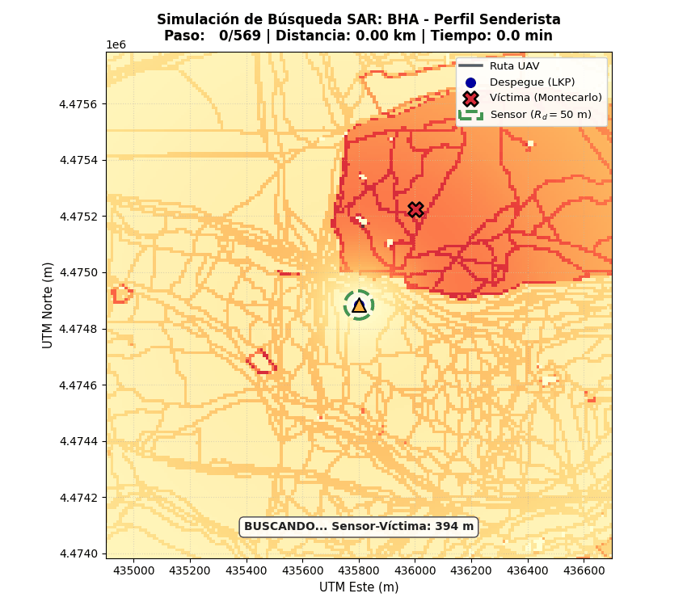

# Intelligent UAV Search & Rescue Routing over Vectorized OpenStreetMap Maps

[-003366?style=flat-square&logo=academia)](memoria/TFM_IA_Juan_Carlos_Estefania.pdf)
[](requirements.txt)
[](LICENSE)
[](https://www.uc3m.es/)
[-6f42c1?style=flat-square)](busquedas/)

> **Master's Thesis in Robotics and Automation**  
> **Universidad Carlos III de Madrid (UC3M)**  
> *Academic Year 2025/2026 — Defended September 30, 2026 (Grade: 9.6 / 10 - Sobresaliente)*  
>
> **Author:** Juan Carlos Estefanía  
> **Advisors:** Prof. Jesús García Herrero & Prof. Juan Pedro Llerena Caña  
> **Research Group:** Applied Artificial Intelligence Group (GIAA) — UC3M  

---

## 📄 Full Documentation

You can read the full academic dissertation here: 👉 **[Download Project Memory (PDF)](memoria/TFM_IA_Juan_Carlos_Estefania.pdf)**

---

## Visual Demonstration

<div align="center">
  
  <p><em>Autonomous UAV trajectory planning using the Black Hole Algorithm (BHA) over an empirical Lost Person Behavior (Hiker profile) probability map in Casa de Campo, Madrid (17.22 km² scenario, 50 m sensor footprint).</em></p>
</div>

---

## Executive Summary

In Wilderness Search and Rescue (WiSAR) operations, rapid response time is critical for missing person survival. Conventional search strategies rely on rigid, geometric sweeps (e.g., Lawnmower sweeps or expanding spirals) that ignore terrain morphology, geographic obstacles, and behavioral dispersion profiles.

This repository hosts **`sarenv-mts`**, a modular end-to-end framework integrating topological GIS modeling, empirical probabilistic priors, and bio-inspired path planners for autonomous Unmanned Aerial Vehicles (UAVs):

1. **Vectorized GIS & Topological Modeling (`sarenv`):** Extracts real-world vector geometries (roads, pathways, natural features, water bodies, and buildings) via OpenStreetMap (OSM) Overpass API.
2. **Empirical Lost Person Behavior (LPB):** Generates spatial probability density functions grounded in Robert Koester's international empirical search and rescue dataset (tailored for Dementia, Children/Autism, Hikers, etc.).
3. **Hard Physical Constraint Filtering:** Employs spatial R-Tree indexing (`geopandas.sindex`) to project impassable physical barriers (water bodies and building footprints) directly onto the grid, enforcing $P = 0.0$ and penalizing unfeasible candidate paths.
4. **Spatial Metric Middleware (`middleware`):** Provides sub-meter numerical conversion between global UTM coordinates (EPSG:32630) and discrete planning grids ($\delta = 10\text{ m/cell}$).
5. **Bio-Inspired Metaheuristics (`busquedas`):** Implements Artificial Bee Colony (**ABC**), Black Hole Algorithm (**BHA**), and Ant Colony Optimization (**ACO**), hyperparameter-tuned through Bayesian Optimization via **Optuna**.
6. **Extensive Monte Carlo Benchmark (900 Missions):** Validates performance on a real-world scenario (Casa de Campo, Madrid) across single-battery constraints (1,000 steps / ~20 min flight), achieving **up to a 7x increase in detection success rate** over standard geometric baselines.

---

## System Architecture

```text
       +--------------------------------------------------------------+
       |                  OpenStreetMap (OSM) API                     |
       |     Roads, Trails, Landcover, Water Bodies, Urban Centers     |
       +------------------------------+-------------------------------+
                                      |
                                      v
       +--------------------------------------------------------------+
       |                     SAREnv Core Engine                       |
       |  - Robert Koester's Lost Person Behavior (LPB) Profiles      |
       |  - R-Tree (sindex) Hard Physical Obstacle Filtering          |
       |  - Coordinate Projection (WGS84 -> UTM EPSG:32630)           |
       +------------------------------+-------------------------------+
                                      |
                                      v
       +--------------------------------------------------------------+
       |                    Spatial Middleware                        |
       |  - Continuous-to-Discrete Grid Mapping (10 m / cell)         |
       |  - Standardized JSON Scenario & Sensor Footprint Matrix      |
       +------------------------------+-------------------------------+
                                      |
                                      v
       +--------------------------------------------------------------+
       |                     MTS Planner Hub                          |
       |  - Metaheuristics: ABC, BHA, ACO, Greedy, Lawnmower          |
       |  - Bayesian Optimization (Optuna Tuning)                     |
       |  - Sensor Model: 50 m Footprint + Residual Belief b(v^k)     |
       +------------------------------+-------------------------------+
                                      |
                                      v
       +--------------------------------------------------------------+
       |               Evaluation & Benchmarking                      |
       |  - PathEvaluatorTFM (Detection Prob., Time-to-Detect, etc.)  |
       |  - 900 Monte Carlo Validations (Informed vs. Blind Targets)  |
       +--------------------------------------------------------------+
```

---

## Experimental Benchmark (900 Monte Carlo Runs)

The framework was benchmarked on the **Casa de Campo** region (Madrid, Spain, $17.22\text{ km}^2$ bounding region, $1,000 \times 1,000$ grid cells at $\delta = 10\text{ m/cell}$):
- **Autonomous Flight Endurance:** Single battery constraint of 1,000 flight steps (~20 minutes).
- **Dual Target Distribution:**
  - **450 Informed Target Simulations:** Victims sampled from empirical Koester distributions (Dementia, Autism, Hiker).
  - **450 Uniform Blind Simulations:** Victims distributed uniformly to assess robustness under uninformative priors.
- **Sensor Configuration:** Footprint radius $r = 25\text{ m}$ (effective swath width of 50 m), with exponential decay detection probability updating the residual belief map $b(v^k)$.

### Key Findings
- **High-Probability Convergence:** Bio-inspired algorithms (notably **BHA** and **ABC**) concentrate flight paths over high-density belief corridors, reaching discovery rates **up to 7× higher** than standard Lawnmower sweeps within battery limitations.
- **Topological Adaptation:** While geometric paths waste up to 40% of their flight budget over water or low-interest clearings, `sarenv-mts` planners exploit linear features (paths and trails) favored by lost individuals.
- **Statistical Significance:** Complete results, boxplots, and ANOVA metrics are fully reproducible in the provided analysis notebooks.

---

## Repository Structure

```text
.
├── memoria/            # Master's Thesis complete academic monograph (PDF)
├── sarenv/             # SAREnv core: OSM downloader, LPB generator, R-Tree filters
├── busquedas/          # Bioinspired planners: ABC, BHA, ACO, Greedy, Lawnmower
├── metrics/            # PathEvaluatorTFM: SAR evaluation metrics suite
├── middleware/         # UTM <-> Grid coordinate transforms & JSON exporters
├── extra/              # Sensor footprint utilities, visualizer & demo animation
├── sensor/             # Realistic sensor footprint models
├── TFM_JC/
│   ├── notebooks/      # Interactive Jupyter notebooks for demos and benchmarks
│   └── resultados/     # Master CSV database (900 simulations) and 300 DPI figures
├── experiments/        # Batch simulation scripts and Optuna hyperparameter tuning
├── requirements.txt    # Python dependencies for full reproducibility
└── README.md           # Project documentation
```

---

## Getting Started

### 1. Clone the Repository

```bash
git clone https://github.com/jcestefania/uav-search-and-rescue.git
cd uav-search-and-rescue
```

### 2. Environment Setup

It is recommended to use Python 3.10 or 3.11 in a virtual environment:

```bash
# Create virtual environment
python -m venv venv

# Activate on Windows:
.\venv\Scripts\activate

# Activate on Linux/macOS:
source venv/bin/activate

# Install dependencies
pip install -r requirements.txt
```

### 3. Interactive Notebooks

Launch Jupyter Lab to explore the three official notebooks located in `TFM_JC/notebooks/`:

```bash
jupyter lab TFM_JC/notebooks/
```

- **`Notebook_Demo_Rapida_Interactiva.ipynb` (Quick Interactive Demo):**  
  Interactive UI with interactive widgets. Select a victim profile (*Dementia*, *Autism*, *Hiker*) and a path planning algorithm (*ABC*, *BHA*, *ACO*, *Greedy*, *Lawnmower*) to visualize the drone's trajectory dynamically alongside the 5 official SAR metrics in real time.

- **`Benchmark_Perfiles_Real_Interactivo.ipynb` (Advanced SAR Engineering Pipeline):**  
  Full end-to-end mission configuration. Download custom OSM bounding boxes, customize multilayer probabilistic weights (`FEATURE_PROBABILITIES`), calibrate Koester dispersion parameters, set battery autonomy limits, and run simultaneous comparative benchmarks.

- **`Analisis_Resultados.ipynb` (Statistical Evaluation & Figure Generator):**  
  Loads the master simulation database (`resultados_totales.csv`, 900 runs), computes parametric and non-parametric statistics (mean, median, IQR), and generates publication-grade 300 DPI boxplots and figures.

---

## Citation

If you use this codebase or the `sarenv-mts` architecture in your research, please cite:

```bibtex
@mastersthesis{estefania2026uav,
  author       = {Juan Carlos Estefan{\'i}a},
  title        = {Optimizaci{\'o}n Inteligente de Rutas de B{\'u}squeda y Rescate con Drones mediante la Integraci{\'o}n de {SAREnv} y {MTS} en Entornos de Incertidumbre},
  school       = {Universidad Carlos III de Madrid (UC3M)},
  year         = {2026},
  month        = {September},
  note         = {Master's Thesis in Robotics and Automation. Grade: 9.6/10 (Sobresaliente)}
}
```

---

## Acknowledgments

Special thanks to the **Applied Artificial Intelligence Group (GIAA)** and the **Department of Computer Science and Engineering** at Universidad Carlos III de Madrid (UC3M) for their scientific guidance, technical support, and computational resources throughout this research.
